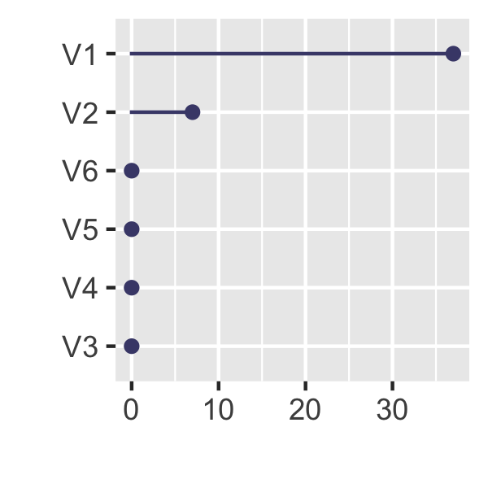
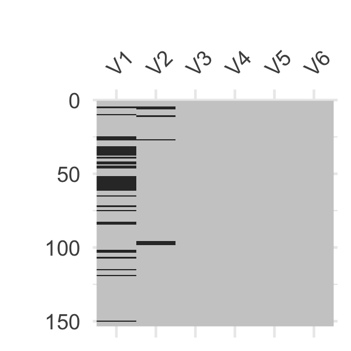
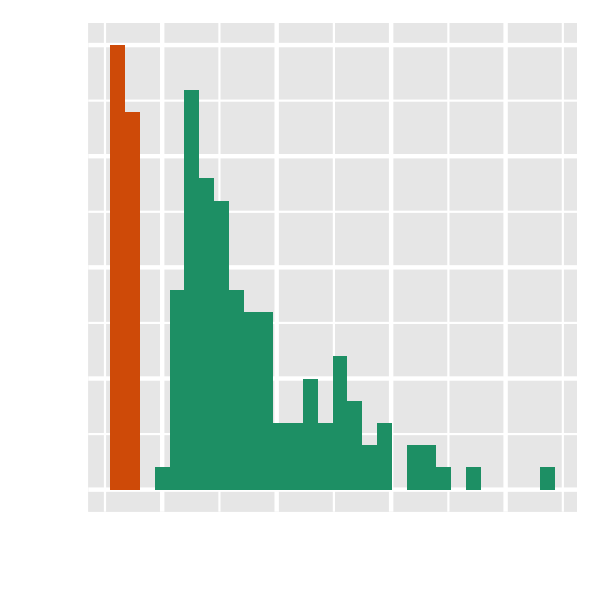
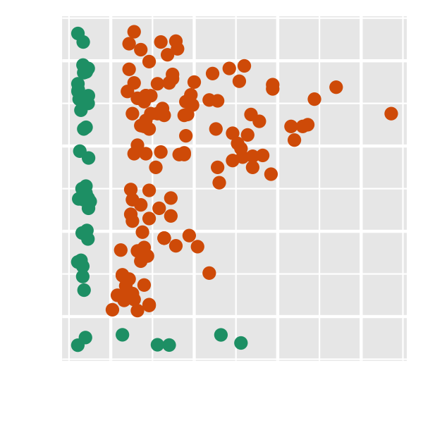

```r
knitr::opts_chunk$set(dev = "png",
                      dpi = 300,
                      fig.path = "diagram-",
                      fig.width = 2, 
                      fig.height = 2)
```


```r
library(naniar)
library(ggplot2)
```


```r
aq <- airquality %>% 
  setNames(paste0("V", 1:6)) 

  gg_miss_var(aq) +
  labs(x = "",
       y = "") +
  theme(axis.text.x = element_blank()) +
  theme_gray()
```

<!-- -->


```r
vis_miss(aq, 
         show_perc_col = FALSE) + 
  theme(legend.position = "none") +
  labs(y = "")
```

<!-- -->


```r
airquality %>%
  nabular() %>%
  impute_below_all() %>%
  ggplot(aes(x = Ozone,
             fill = Ozone_NA)) + 
  geom_histogram() + 
  scale_fill_brewer(palette = "Dark2") + 
  theme(legend.position = "none") +
  labs(x = "",
       y = "") +
  theme(axis.ticks = element_blank(),
        axis.text = element_blank())
```

```
## `stat_bin()` using `bins = 30`. Pick better value with `binwidth`.
```

<!-- -->


```r
ggplot(data = airquality,
       aes(x = Ozone,
           y = Solar.R)) + 
  geom_miss_point() + 
  scale_colour_brewer(palette = "Dark2") + 
  theme(legend.position = "none") +
  labs(x = "",
       y = "") +
  theme(axis.ticks = element_blank(),
        axis.text = element_blank())
```

<!-- -->

